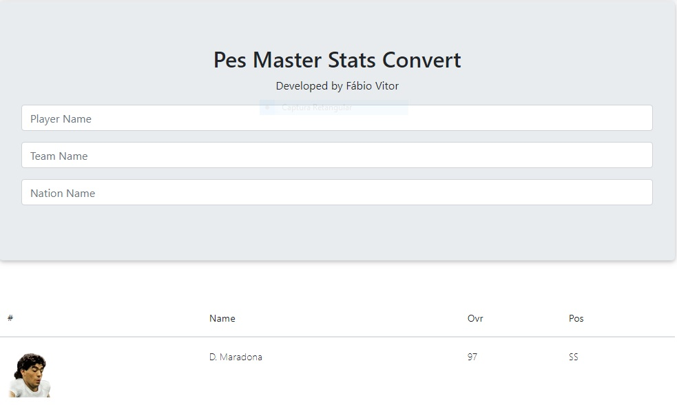

# PyMaster (Pes2021 stats to PES6)
<!---Esses são exemplos. Veja https://shields.io para outras pessoas ou para personalizar este conjunto de escudos. Você pode querer incluir dependências, status do projeto e informações de licença aqui--->




> Preview do projeto online.

### Ajustes e melhorias

O projeto ainda está em desenvolvimento e as próximas atualizações serão voltadas nas seguintes tarefas:

- [x] Extração dos jogadores do Site pesmaster;
- [x] inserir os dados dos jogadores em um banco SQLite;
- [x] Criação da API Rest com o micro-framework Flask;
- [x] Consumir API Rest com Javascript;
- [x] Criação do Frontend com auxilio do bootstrap.

## 💻 Pré-requisitos

Antes de começar, verifique se você atendeu aos seguintes requisitos:
<!---Estes são apenas requisitos de exemplo. Adicionar, duplicar ou remover conforme necessário--->
* Você instalou a versão mais recente do `<Python3">`
* Você tem uma máquina `<Windows / Linux / Mac>`.
* Você instalou todas as dependências do `"requiriments.txt"`.

## 🚀 Executando o PyMaster (Pes2021 stats to PES6)

Para executar, siga estas etapas:

Linux, macOS & Windows:

Vá até a pasta do projeto e execute o seguinte comando
```
flask run
```
URL para acessar o projeto no navegador:

```
http://localhost:5000
````


## ☕ Usando o PyMaster (Pes2021 stats to PES6)

Para usar, siga estas etapas:

```
Você pode pesquisar pelo nome dos jogadores, times e nacionalidade. 
Ao clicar no jogador é exibido as suas habilidades para PES6 e um botão para copiar.

```

É possível acessar o painel ADM onde é possível cadastrar novos usuários e novos jogadores.

## 📫 Contribuindo para PyMaster (Pes2021 stats to PES6)
<!---Se o seu README for longo ou se você tiver algum processo ou etapas específicas que deseja que os contribuidores sigam, considere a criação de um arquivo CONTRIBUTING.md separado--->
Para contribuir com PyMaster (Pes2021 stats to PES6), siga estas etapas:

1. Bifurque este repositório.
2. Crie um branch: `git checkout -b <nome_branch>`.
3. Faça suas alterações e confirme-as: `git commit -m '<mensagem_commit>'`
4. Envie para o branch original: `git push origin <nome_do_projeto> / <local>`
5. Crie a solicitação de pull.

Como alternativa, consulte a documentação do GitHub em [como criar uma solicitação pull](https://help.github.com/en/github/collaborating-with-issues-and-pull-requests/creating-a-pull-request).

## 🤝 Colaboradores

Agradecemos às seguintes pessoas que contribuíram para este projeto:

<table>
  <tr>
    <td align="center">
      <a href="#">
        <br>
        <sub>
          <b>Fábio Vitor</b>
        </sub>
      </a>
    </td>
    
  </tr>
</table>


## 😄 Seja um dos contribuidores<br>

Quer fazer parte desse projeto? Clique [AQUI](CONTRIBUTING.md) e leia como contribuir.

## 📝 Licença

Esse projeto está sob licença. Veja o arquivo [LICENÇA](LICENSE.md) para mais detalhes.

[⬆ Voltar ao topo](#pymaster-pes2021-stats-to-pes6)<br>
